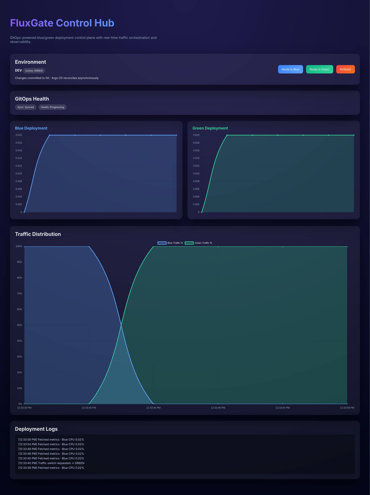
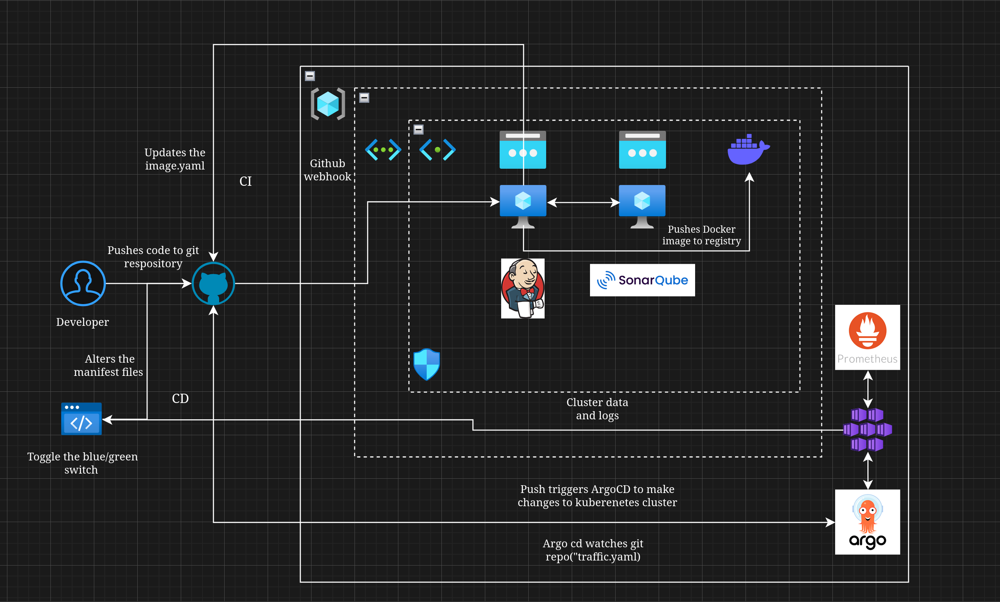
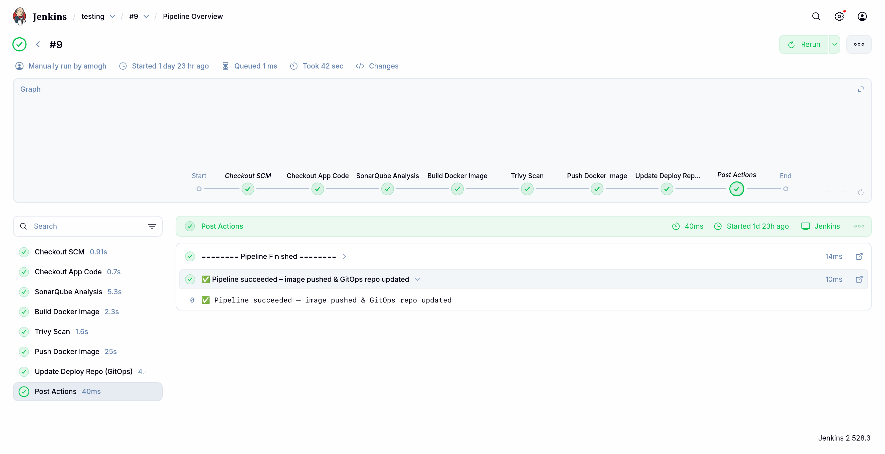

# 🚀 FluxGate — GitOps Blue-Green Control Hub

FluxGate is a **GitOps-driven deployment control platform** that enables **safe, observable blue-green deployments on Kubernetes** using **Jenkins, Argo CD, and Prometheus**, with a centralized **Control Hub UI** for traffic switching and visibility.

This project demonstrates **real-world DevOps and Platform Engineering practices**, not just CI/CD pipelines.

---

## 🧠 What is FluxGate?

FluxGate acts as a **control plane** on top of Kubernetes.

Instead of directly mutating the cluster:
- **All deployment and traffic changes happen via Git**
- Argo CD continuously reconciles the desired state
- Every change is auditable, reversible, and production-safe

> No `kubectl apply` from CI.  
> No manual traffic switching.  
> Git is the single source of truth.

---

## 🧱 High-Level Architecture

### Fluxgate control panel
![FluxGate Architecture] 

FluxGate follows a **GitOps-first control-plane architecture**, where Git is the single source of truth and Argo CD is responsible for reconciliation.

---

### 🔄 CI/CD & GitOps Flow

**Flow explanation:**
1. Developer pushes application code to GitHub
2. Jenkins CI pipeline is triggered
3. Code is scanned, built, and containerized
4. Jenkins updates GitOps manifests (image / traffic config)
5. Argo CD detects Git changes and reconciles the cluster
6. FluxGate UI reflects live deployment state and metrics

---

### ⚙️ Jenkins CI Pipeline

The Jenkins pipeline is responsible for:
- Code checkout
- Static analysis (SonarQube)
- Docker image build
- Image security scanning
- Pushing images to registry
- Updating GitOps deployment manifests

> Jenkins **never deploys directly** to Kubernetes.  
> Argo CD handles all cluster reconciliation.

---

## ❗ Problems FluxGate Solves

### 🚨 Unsafe Production Deployments
Traditional pipelines often deploy directly to Kubernetes using `kubectl`, making rollbacks risky and changes hard to audit.

**FluxGate solves this by:**
- Enforcing Git as the only deployment trigger
- Preventing direct cluster mutations
- Making every change traceable and reversible

---

### 🔄 Manual and Error-Prone Traffic Switching
Blue-green deployments are often implemented manually, leading to human errors during traffic cutovers.

**FluxGate solves this by:**
- Managing traffic switches declaratively via Git
- Providing a one-click control plane UI
- Eliminating manual service reconfiguration

---

### 🔍 Lack of Deployment Visibility
Teams often deploy blindly without real-time insight into system health.

**FluxGate solves this by:**
- Integrating Prometheus metrics
- Showing live CPU, memory, and pod counts
- Surfacing Argo CD sync and health status

---

### 🧾 No Audit Trail or Rollback Strategy
Without GitOps, it’s hard to answer:
> “Who changed what, and when?”

**FluxGate solves this by:**
- Using Git commits as the audit log
- Making rollbacks a simple Git revert
- Keeping deployment history immutable

---

### 🧱 Tight Coupling Between CI and CD
Many systems let CI pipelines deploy directly to production, increasing blast radius.

**FluxGate solves this by:**
- Strictly separating CI (Jenkins) and CD (Argo CD)
- Letting CI produce artifacts only
- Letting CD reconcile desired state independently

---

